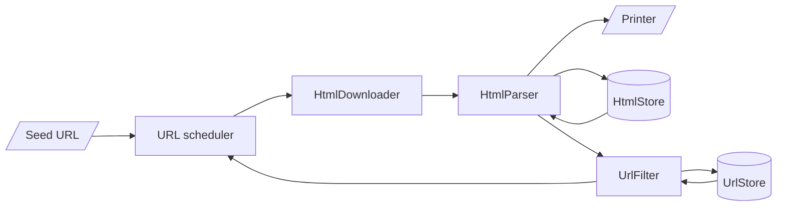

# web-crawler-rs
A web crawler, written in Rust, which is designed to crawl a single domain. For each URL visited a list of links are printed to `stdout`. If you're just getting started with Rust, see the [Install Rust](https://www.rust-lang.org/tools/install) page for instructions on how to get started.

## Usage

```
$ cargo run -r -- https://monzo.com/
```

To run tests:
```
$ cargo test
```

## Assumptions

- The chosen domain can be crawled without delay.
- Setting the `User-Agent` header to `Mozilla/5.0 (Windows NT 10.0; Win64; x64)` is sufficient to bypass CloudFlare protection.

## Design

<!-- Below is a Mermaid diagram which displays automatically on GitHub/Lab. See https://mermaid.js.org/ for more information -->



The web crawler uses [Tokio's async runtime](https://tokio.rs/tokio/tutorial) to process multiple URLs concurrently. This is achieved in the `run()` function where an event loop takes new URLs off a queue and spawns a task to concurrently fetch, parse, filter and enqueue new URLs. Many tasks are run on a small number of threads by leveraging Tokio's async runtime.

### URL Scheduler
A multi-producer, single-consumer (mpsc) channel is set up to manage the queue of URLs to crawl. This channel is initialised with a buffer size of 100, providing natural backpressure and preventing excessive memory use.

### HtmlDownloader
Asynchronously fetches the HTML content from a given URL using the `reqwest` client.

### HtmlParser
Parses the HTML body to extract links. Initially the hash of the body is calculated and compared to values stored in the `HtmlStore` to determine whether this page has been seen before. This can happen if two different URLs route to the same page. New values are added to this store as part of the lookup.

### UrlFilter
URLs are filtered based on the following criteria:
- If they been visited before, by performing a lookup in the `UrlStore`. New URLs are added to this store as part of the lookup.
- If they are disallowed by the domain's `robots.txt`.
- If the URL does not match the subdomain being crawled.

### Store
Provides a thread safe data store. This implementation uses a `HashSet` but could be modified to interface with a cache or persistant storage library to scale-up the solution with minimal changes to application code.

## Improvements
- URL filtering to avoid spider traps. Examples of this could be a link to a calendar which has an infinite number of pages, or an infinitely deep directory structure.
- Config for politeness. Set how long to wait between making requests to the same domain.
- Add retry behaviour to requests with exponential back-off when the server is currently busy.
- Config for async runtime settings. By default, the tokio runtime uses a thread pool matching the number of CPU cores.
- A cache DNS resolver could improve performance by limiting the number of DNS requests made on the network.
